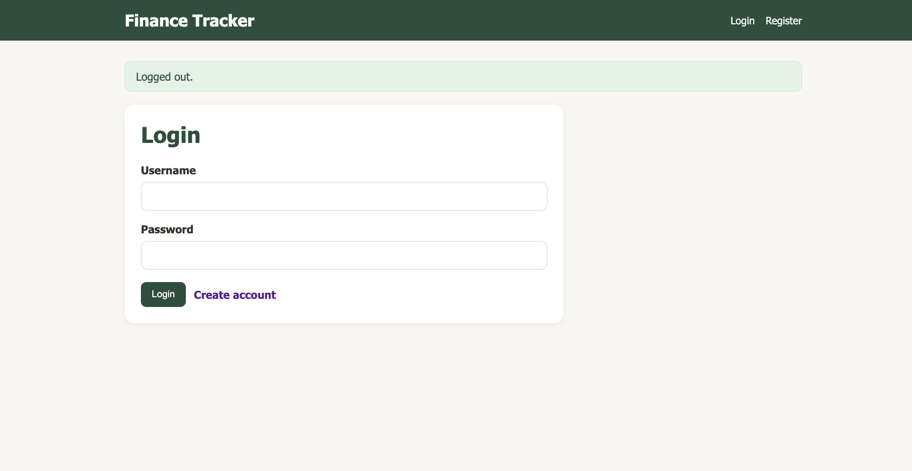
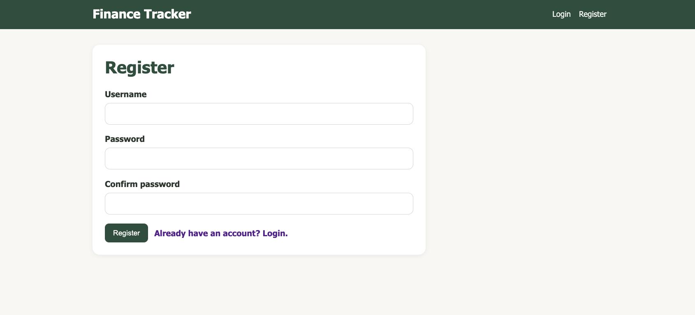
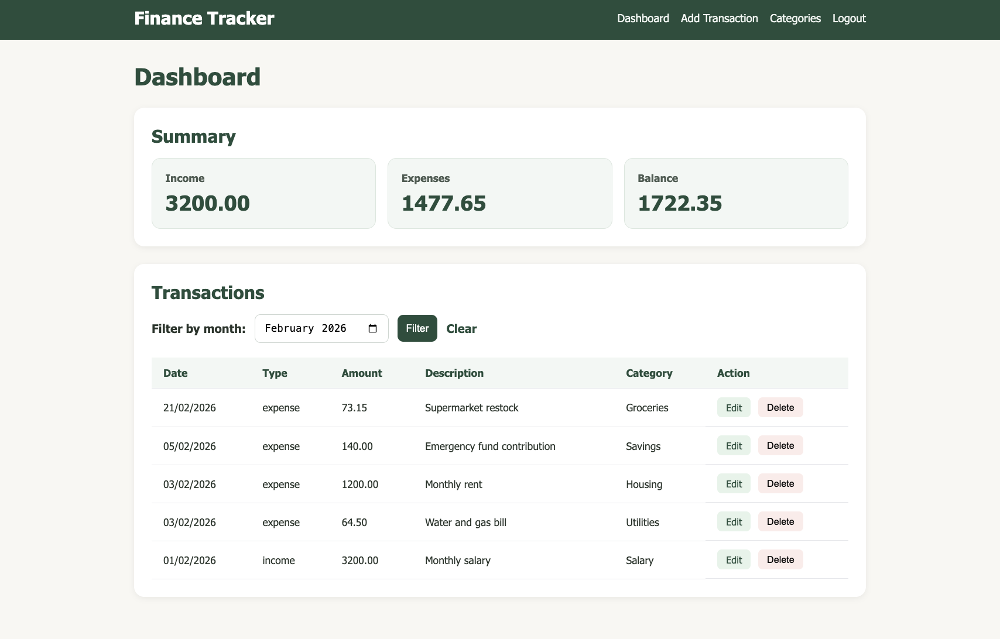
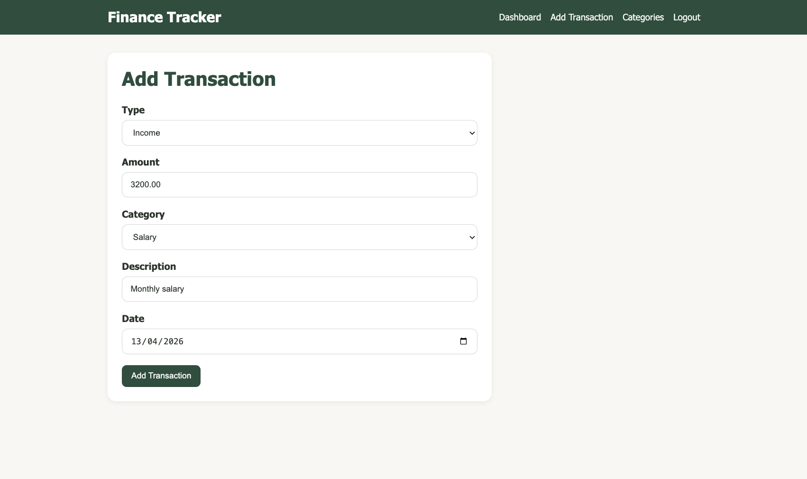
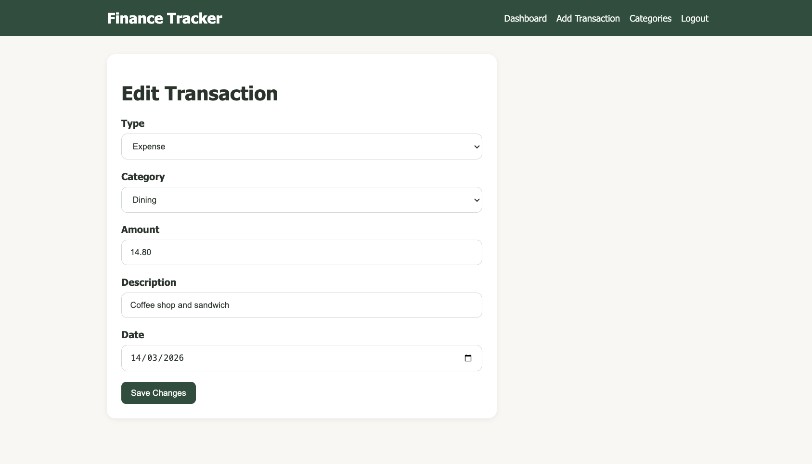
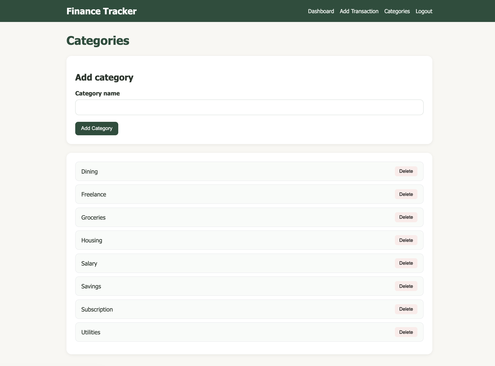

# Finance Tracker

#### Video Demo:  

#### Description:

Finance Tracker is a web application that helps users manage their personal finances by tracking income and expenses in a simple and organized way.

Users can register, log in, and create transactions that include a type (income or expense), amount, category, description, and date. Each user has their own data, and all routes are protected using session-based authentication.

The application also allows users to create custom categories, which are linked to transactions using a relational database structure.

On the dashboard, users can view all their transactions along with a financial summary that includes total income, total expenses, and current balance. A month filter was also implemented to allow users to view transactions from a specific month.

---

## Tech Stack

- Python (Flask)
- SQLite
- HTML, CSS (Jinja templates)
- Flask-Session (session management)

---

## Features

- User authentication (register, login, logout)
- Add, edit, and delete transactions
- Custom categories per user (create and delete)
- Dashboard with financial summary
- Month-based transaction filtering
- Input validation on all forms
- Secure handling of user-specific data (users can only access and modify their own records)

---

## Screenshots

Below are some screenshots demonstrating the main features of the application:

### Authentication
Login + Register





### Core Features
Dashboard + Transactions







### Management
Categories



---


## Files and Structure

### `app.py`

This is the main Flask application file.

It contains:
- all routes (`/`, `/login`, `/register`, `/add`, `/edit`, `/delete`, `/categories`)
- session handling
- validation logic for forms
- SQL queries for interacting with the database
- calculation of totals (income, expenses, balance)

A custom `login_required` decorator is used to protect routes that require authentication.

---

### `schema.sql`

Defines the database structure with three main tables:

- `users` → stores user credentials
- `categories` → stores user-defined categories
- `transactions` → stores all financial transactions

The database uses:
- foreign keys
- unique constraints
- check constraints
- an index on `(user_id, date)` for better performance

---

### `templates/`

Contains all HTML templates rendered by Flask:

- `layout.html` → base layout with navigation
- `index.html` → dashboard
- `add.html` → add transaction form
- `edit.html` → edit transaction form
- `login.html` → login page
- `register.html` → registration page
- `categories.html` → category management

Templates use Jinja to render dynamic data.

---

### `static/styles.css`

Contains all styling for the application.

A consistent UI system was implemented using reusable classes for:
- cards
- forms
- buttons
- tables

---

## Design Decisions

One important design decision was storing monetary values as `amount_cents` instead of floating-point numbers. This avoids precision issues when working with financial data.

Another key decision was validating that categories belong to the logged-in user before allowing them to be used in transactions. This ensures data integrity and prevents users from accessing data that is not theirs.

The dashboard uses a `LEFT JOIN` to display category names alongside transactions, allowing for a cleaner and more informative interface.

Category deletion was implemented with care to maintain database integrity. When a category is deleted, related transactions are not removed, instead, their category reference is set to `NULL`, ensuring that no financial data is lost.


---

## How to Run

1. Clone the repository:

```bash
git clone https://github.com/thekellymarques/finance-tracker.git
cd finance-tracker
```

2. Create a virtual environment:

```bash
python -m venv venv
source venv/bin/activate
```

(Windows)

```bash
venv\Scripts\activate
```

3. Install dependencies:

```bash
pip install -r requirements.txt
```

4. Initialize the database:

```bash
sqlite3 finance.db < schema.sql
```

5. Run the application:

```bash
flask run
```

Then open your browser and go to:
http://127.0.0.1:5000

---

## What I Learned

This project helped me understand how to build a full web application using Flask, including:

- routing and request handling
- session-based authentication
- SQL queries and database relationships
- CRUD operations
- form validation
- structuring a multi-page application with templates

It also helped me understand how backend logic, database design, and frontend templates work together in a complete system.

---

## Acknowledgements

AI tools (such as ChatGPT) were used as a learning aid during development, particularly for debugging, UI improvements, and structuring documentation. All code and design decisions were implemented and understood by me.